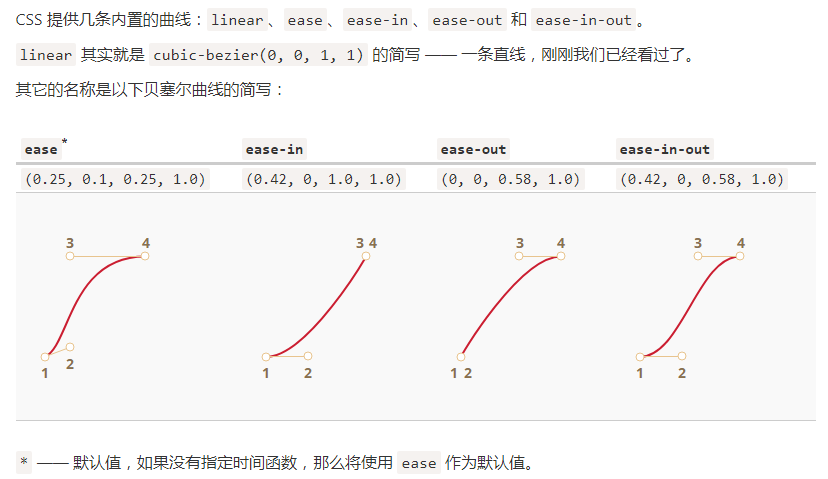

# 动画

## CSS 动画

### CSS 过渡（transition）

只需要定义某一个属性以及如何动态地表现其变化。当属性变化时，浏览器将会绘制出相应的过渡动画

#### 描述属性

- transition-property
- transition-duration
- transition-timing-function
- transition-delay

使用 `transition` 简写顺序: `property` `duration` `timing-function` `delay`

##### transition-timing-function

- 贝塞尔曲线



横坐标表示时间，纵坐标表示完成进度

- 阶跃函数

```css
steps(number of steps[, start/end])
```

第一个参数表示段数。
第二个参数可以取 start 或 end 两者其一，start 每一段开头就进行动画，end 表示每一段的最后时刻开始动画

#### transitionend 事件

CSS 动画完成后，会触发 transitionend 事件

### 关键帧动画（Keyframes）

## JavaScript 动画

### requestAnimationFrame

```js
let requestId = requestAnimationFrame(callback);
// 取消回调的周期执行
cancelAnimationFrame(requestId);
```

通用的动画函数

```js
function animate({timing, draw, duration}) {

  let start = performance.now();

  requestAnimationFrame(function animate(time) {
    // timeFraction 从 0 增加到 1
    let timeFraction = (time - start) / duration;
    if (timeFraction > 1) timeFraction = 1;

    // 计算当前动画状态(timing 类似 CSS 的 transition-timing-function)
    let progress = timing(timeFraction);

    draw(progress); // 绘制

    if (timeFraction < 1) {
      requestAnimationFrame(animate);
    }

  });
}
```
