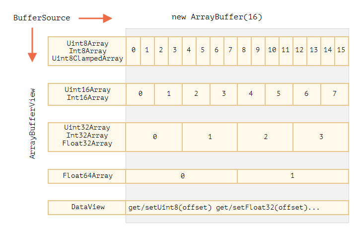

# 二进制数据

## ArrayBuffer

基本的二进制对象是 ArrayBuffer —— 对固定长度的连续内存空间的引用

```js
let buffer = new ArrayBuffer(16); // 创建一个长度为 16 的 buffer
console.log(buffer.byteLength); // 16

let view = new Uint32Array(buffer); // 将 buffer 视为一个 32 位整数的序列
console.log(view.length); // 4，它存储了 4 个整数
console.log(view.byteLength); // 16，字节中的大小
```

> ArrayBuffer 不是某种东西的数组

- 长度是固定的，我们无法增加或减少它的长度
- 正好占用了内存中的那么多空间
- 要访问单个字节，需要另一个“视图”对象，而不是 `buffer[index]`



### TypedArray

### DataView

DataView 是在 ArrayBuffer 上的一种特殊的超灵活“未类型化”视图。它允许以任何格式访问任何偏移量（offset）的数据

## Blob

ArrayBuffer 和视图（view）都是 ECMA 标准的一部分，是 JavaScript 的一部分，在浏览器中，还有其他更高级的对象，特别是 Blob。

ArrayBuffer，Uint8Array 及其他 BufferSource 是“二进制数据”，而 Blob 则表示“具有类型的二进制数据”

```js
new Blob(blobParts, options);
```

- blobParts 是 Blob/BufferSource/String 类型的值的数组。
- options 可选对象：
  - type —— Blob 类型，通常是 MIME 类型，例如 image/png，
  -endings —— 是否转换换行符，使 Blob 对应于当前操作系统的换行符（\r\n 或 \n）。默认为 "transparent"（啥也不做），不过也可以是 "native"（转换）。

### Blob 用作 URL

```html
<!-- download 特性（attribute）强制浏览器下载而不是导航 -->
<a download="hello.txt" href='#' id="link">Download</a>

<script>
  let blob = new Blob(["Hello, world!"], {type: 'text/plain'});
  link.href = URL.createObjectURL(blob);
</script>

<!-- 或者也如可以这样 -->
<script>
  let blob = new Blob(['Hello, world!'], {type: 'text/plain'});
  let link = document.createElement('a');
  link.download = 'hello.txt';
  link.href = URL.createObjectURL(blob);
  link.click();
  URL.revokeObjectURL(link.href);
</script>
```

如果我们创建一个 URL，那么即使我们不再需要该 Blob 了，它也会被挂在内存中，URL.revokeObjectURL(url) 从内部映射中移除引用，因此允许 Blob 被删除（如果没有其他引用的话），并释放内存

### blob 转 base64

```js
let link = document.createElement('a');
link.download = 'hello.txt';

let blob = new Blob(['Hello, world!'], {type: 'text/plain'});

let reader = new FileReader();
reader.readAsDataURL(blob); // 将 Blob 转换为 base64 并调用 onload

reader.onload = function() {
  link.href = reader.result; // data url
  link.click();
};
```

### Image 转 blob

```js
// 获取任何图像
let img = document.querySelector('img');

// 生成同尺寸的 <canvas>
let canvas = document.createElement('canvas');
canvas.width = img.clientWidth;
canvas.height = img.clientHeight;

let context = canvas.getContext('2d');

// 向其中复制图像（此方法允许剪裁图像）
context.drawImage(img, 0, 0);
// 我们 context.rotate()，并在 canvas 上做很多其他事情

// toBlob 是异步操作，结束后会调用 callback
canvas.toBlob(function(blob) {
  // blob 创建完成，下载它
  let link = document.createElement('a');
  link.download = 'example.png';

  link.href = URL.createObjectURL(blob);
  link.click();

  // 删除内部 blob 引用，这样浏览器可以从内存中将其清除
  URL.revokeObjectURL(link.href);
}, 'image/png');
```

## File

File 对象继承自 Blob，并扩展了与文件系统相关的功能

- 第一种获取方式

```js
new File(fileParts, fileName, [options])
```

- 第二种获取方式

```html
<input type="file">
```

### FileReader

FileReader 是一个对象，其唯一目的是从 Blob（因此也从 File）对象中读取数据

```js
let reader = new FileReader(); // 没有参数
```

- readAsArrayBuffer(blob) —— 将数据读取为二进制格式的 ArrayBuffer
- readAsText(blob, [encoding]) —— 将数据读取为给定编码（默认为 utf-8 编码）的文本字符串
- readAsDataURL(blob) —— 读取二进制数据，并将其编码为 base64 的 data url
- abort() —— 取消操作
