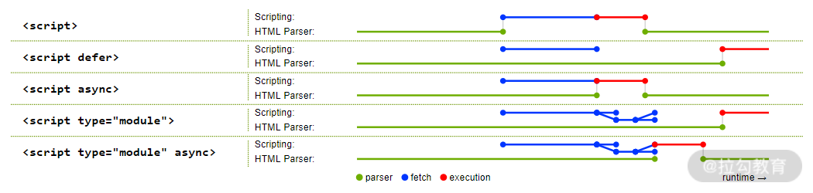

# 脚本



## defer

defer 特性告诉浏览器它应该继续处理页面，并“在后台”下载脚本，然后等页面加载完成后，再执行此脚本

- 具有 defer 特性的脚本不会阻塞页面
- 具有 defer 特性的脚本总是要等到 DOM 解析完毕，但在 DOMContentLoaded 事件之前执行
- 多个 defer 脚本下载完成后按照文档顺序执行
- defer 特性仅适用于外部脚本（必须有 src）

## async

- 页面不会等待异步脚本，它会继续处理并显示页面内容
- 准备好后立即运行
- DOMContentLoaded 和异步脚本不会彼此等待（谁先谁后都有可能）
- 其他脚本不会等待 async 脚本加载完成，同样，async 脚本也不会等待其他脚本

## 动态脚本

可以使用 JavaScript 动态地添加脚本

```js
let script = document.createElement('script');
script.src = "/article/script-async-defer/long.js";
document.body.append(script); // (*)
```

默认情况下，动态脚本的行为是“异步”的（即 `script.async = true`）

## type="module"

- 下载外部模块脚本 `<script type="module" src="...">` 不会阻塞 HTML 的处理，会与其他资源并行加载
- 模块脚本会等到 HTML 文档完全准备就绪（即使它们很小并且比 HTML 加载速度更快），然后才会运行
- 保持脚本的相对顺序：在文档中排在前面的脚本先执行

## 实际场景

- defer 用于需要整个 DOM 的脚本，和/或脚本的相对执行顺序很重要的时候
- async 用于独立脚本，例如计数器或广告，这些脚本的相对执行顺序无关紧要
