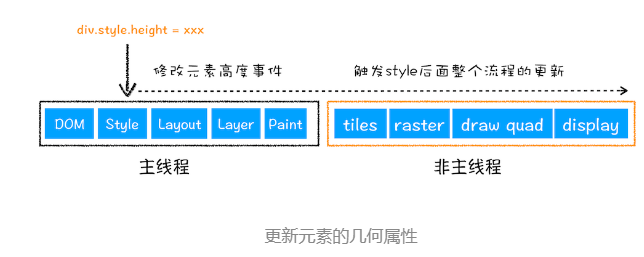

# 浏览器工作原理

## Chrome 多进程架构

- **浏览器进程**。主要负责界面显示、用户交互、子进程管理，同时提供存储等功能
- **渲染进程**。核心任务是将 HTML、CSS 和 JavaScript 转换为用户可以与之交互的网页，**排版引擎 Blink 和 JavaScript 引擎 V8** 都是运行在该进程中，默认情况下，Chrome 会为每个 Tab 标签创建一个渲染进程。出于安全考虑，渲染进程都是运行在沙箱模式下
- **GPU 进程**
- **网络进程**。主要负责页面的网络资源加载
- **插件进程**。主要是负责插件的运行

Chrome的默认策略是，每个标签对应一个渲染进程。但是如果从一个页面打开了新页面，而新页面和当前页面属于同一站点时，那么新页面会复用父页面的渲染进程。官方把这个默认策略叫 process-per-site-instance

## 输入URL到页面展示过程

1. 用户输入，判断是搜索内容或者是请求的 URL
2. URL 请求过程
   1. 检查缓存，如果有缓存资源，则直接返回资源到浏览器主进程，如果没有缓存，进入下一步
   2. DNS => HTTP/HTTPS
   3. 接收响应数据
      1. 检查重定向，如果是重定向类的请求则重新导航到响应头中 Location 地址
      2. 响应数据类型 `Content-Type`
3. 准备渲染进程
   1. 通常打开新的页面会使用单独的渲染进程
   2. 如果从一个页面打开了另一个新页面，而新页面和当前页面属于同一站点（根域名和协议相同）的话，那么新页面会复用父页面的渲染进程
4. 提交文档（URL 请求的响应体数据）
  
  提交文档的过程由浏览器主进程发起，渲染进程接收，提交文档确认后，浏览器会更新界面状态
5. 渲染阶段

### 渲染流程

#### 构建 DOM 树

- document 就是 DOM 结构
- DOM 是保存在内存中的树状结构，可以通过 JS 查询和修改

#### 样式计算（Recalculate Style）

1. CSS 文本 => 浏览器理解的 styleSheets (document.styleSheets)
   1. 通过 link 引用的 CSS 文件
   2. `<style>` 标签中的 CSS
   3. 元素的 style 属性内嵌的 CSS
2. 转换样式表中的属性值，使其标准化
3. 计算出 DOM 树中每个节点的具体样式
   1. 继承：每个 DOM 节点都包含有父节点的样式
   2. 层叠：合并来自多个源的属性值

#### 布局阶段

1. 创建布局树
   1. 遍历 DOM 树中的所有可见节点，并把这些节点加到布局中
   2. 不可见的节点会被布局树忽略掉
2. 布局计算，计算布局树节点的坐标位置，把信息保存到布局树中

#### 分层

渲染引擎还需要为特定的节点生成专用的图层，并生成一棵对应的图层树

并不是布局树的每个节点都包含一个图层，如果一个节点没有对应的层，那么这个节点就从属于父节点的图层

通常满足下面两点中任意一点的元素就可以被提升为单独的一个图层

1. 拥有层叠上下文属性的元素会被提升为单独的一层，[参考这篇文章](https://developer.mozilla.org/zh-CN/docs/Web/Guide/CSS/Understanding_z_index/The_stacking_context)
2. 需要剪裁（clip）的地方也会被创建为图层

#### 图层绘制

准备图层的绘制列表，把图层的绘制过程拆分成很小的绘制指令

#### 栅格化（raster）操作

- 主线程把绘制列表提交到合成线程
- 合成线程会将图层划分为图块（tile），这些图块的大小通常是 256x256 或者 512x512
- 合成线程会按照视口附近的图块来优先生成位图，实际生成位图的操作是由栅格化来执行的。所谓栅格化，是指将图块转换为位图

#### 合成与显示

一旦所有图块都被光栅化，合成线程就会生成一个绘制图块的命令——“DrawQuad”，然后将该命令提交给浏览器进程

### 相关概念

#### 重排

通过 JavaScript 或者 CSS 修改元素的几何位置属性，例如改变元素的宽度、高度等，那么浏览器会触发重新布局
重排需要更新完整的渲染流水线

#### 重绘

重绘省去了布局和分层阶段，所以执行效率会比重排操作要高一些

#### 直接合成阶段

