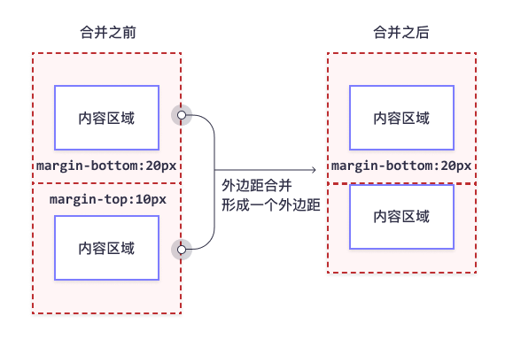
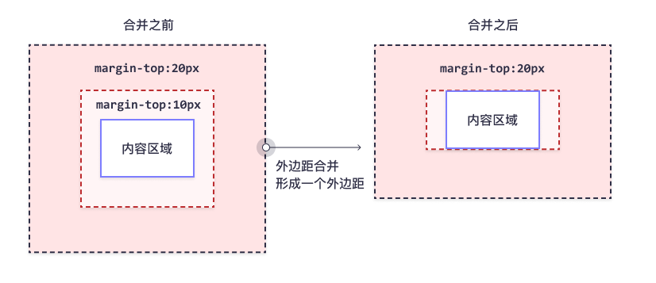

# 边距

## 外边距

### 外边距合并

外边距合并指的是，当两个垂直外边距相遇时，它们将形成一个外边距。

合并后的外边距的高度等于两个发生合并的外边距的高度中的较大者。

当一个元素出现在另一个元素上面时，第一个元素的下外边距与第二个元素的上外边距会发生合并

当一个元素包含在另一个元素中时（假设没有内边距或边框把外边距分隔开），它们的上和/或下外边距也会发生合并

假设有一个空元素，它有外边距，但是没有边框或填充。在这种情况下，上外边距与下外边距就碰到了一起，它们会发生合并

> 注：只有普通文档流中块框的垂直外边距才会发生外边距合并。行内框、浮动框或绝对定位之间的外边距不会合并

## 内边距
