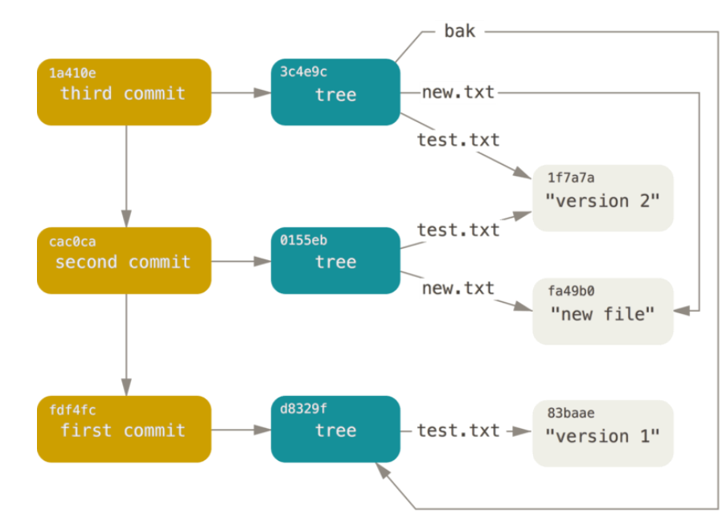

# Git 核心概念

## 区域

- 工作区
- 暂存区
- 版本库

## 对象

### Git 对象

- 真正存储内容的对象
- git 对象是一个 blob 类型的对象
- blob 类型的对象就是一个 key-value 的键值对
- key 是 value 的 hash 值

```sh
# 向数据库写入内容，返回 hash 键值
git hash-object -w 文件路径

# 根据键值拉取数据
git cat-file -p 514c833ae

# 示例
$ echo "xxx" > 1.txt
$ git hash-object -w 1.txt
d6459e005434a49a66a3ddec92279a86160ad71f
$ echo "xxxyyyy" >> 1.txt
$ git hash-object -w 1.txt
eda90536466c820224734f4cbf9c100fe6f40cf6
$ git cat-file -p d6459e
xxx
$ git cat-file -p eda905
xxx
xxxyyyy
$ git cat-file -t eda905 # 获取内部存储对象的类型
blob
```

### 树对象

- 树对象是 tree 类型的对象
- git 对象存储数据，树对象存储目录项
- 一个树对象可以包含一条或者多条记录（可以是git 对象或者树对象）
- 每个树对象对应一个项目的快照

### 提交对象

- 提交对象是 commit 类型的对象
- 需要指定一个树对象
- commit 对象实际上是对树对象的描述，记录提交信息
- 指定父提交对象，形成提交链



### 基础流程原理

- git add .
  - git hash-object -w 文件名（为每个文件创建 git 对象）
  - git update index ... 文件加入缓存区

- git commit -m 'xxx'
  - git write-tree  保存树对象
  - git commit-tree 树对象生成提交对象


## .git 目录

- hooks 目录包含客户端或服务端的钩子脚本
- info 包含一个全局性排除文件
- logs 保存日志信息
- objects 目录存储所有数据内容
- refs 目录存储指向数据的提交对象的指针（分支）
- config 文件包含项目特有的配置选项
- description 用来显示对仓库的描述信息
- HEAD 文件指示目前被检出的分支
- index 文件保存暂存区信息
