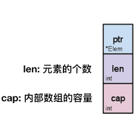
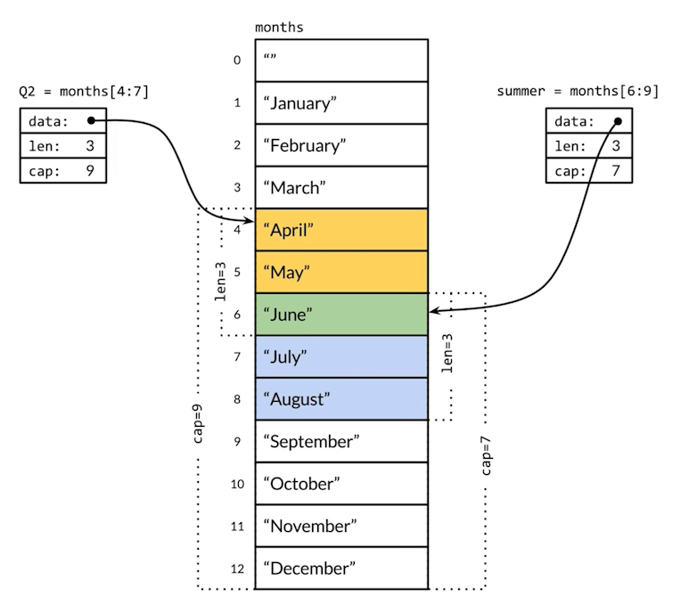

# 数组和切片

## 数组

### 声明

```go
var a [3]int // 声明并初始化为默认零值
b := [3]int{1, 2, 3}
c := [3][2]int{{1, 2}, {2, 3}, {3, 4}}
d := [...]int{1, 2, 3}
```

### 遍历

```go
for i := 0; i < len(arr); i++ {
	// ...
}
for _, v := range arr {
	// ...
}
```

### 数组截取

- 同其他语言类似

- 不支持负数截取

## 切片

是一个结构体



### 声明

```go
var s0 []int // s0 := []int{}
fmt.Println(s0, len(s0), cap(s0)) // [] 0 0
s1 := []int{1, 2, 3}
fmt.Println(s1, len(s1), cap(s1)) // [1 2 3] 3 3

// func make(t Type, size ...IntegerType) Type
s2 := make([]int, 2, 2)
fmt.Println(s2, len(s2), cap(s2)) // [0 0] 2 2

// func append(slice []Type, elems ...Type) []Type
s2 = append(s2, 1) // 指数扩容，每次扩容都增长一倍
fmt.Println(s2, len(s2), cap(s2)) // [0 0 1] 3 4
```

### 共享的存储结构



### 与数组的区别

- 切片容量可伸缩
- 切片不可比较