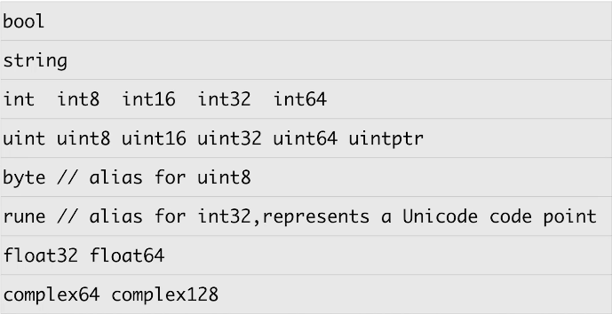

# Go 语言基础知识

!> 主要记录区别于其他语言的部分

## 变量和常量

### 变量

```go
// 赋值方式
var a int = 1
var (
	b int = 1
	c     = 2 // 自动类型推断
)
c := 1 // 自动类型推断
a, b = b, a // 值的交换
```

- 如果变量定义了但是没有使用，编译器会报错
- 不应该使用花里胡哨的语法定义变量

### 常量

```go
// 快速设置连续变量
const (
    Monday = iota   // 0
    Tuesday         // 1  
    Wednesday       // 2
    // ...
)

// 比特位常量连续赋值
const (
	Open = 1 << iota // 0b0001
    Close            // 0b0010
    Pending          // 0b0100
)
```


## 基本数据类型



- Go 语言不支持隐式数据类型的转换，就算是别名与原有数据类型也不能进行转换

  ```go
  type MyInt int
  var a int = 10
  var b int64 // 64 位机器上 int 实际上跟 int64 等价
  var c MyInt
  
  b = a // error: cannot use a (type int) as type int64 in assignment
  c = a // error: cannot use a (type int) as type MyInt in assignment
  
  // 只能进行显式的类型转换
  b = int64(a)
  c = MyInt(a)
  ```

- 类型的预定义值

  ```go
  math.MaxInt64
  math.MaxFloat64
  math.MaxUint32
  ```

- 不支持指针运算

- 字符串的默认值是空字符串

  ```go
  var a string
  if a == "" {
      fmt.Println("length(a): ", len(a)) // length(a):  0
  }
  ```

## 运算符

- 不支持前置++ 和前置--

- 可以用 `==` 对数组进行比较

  - 相同维数且含有相同个数元素的数组才可以比较
  - 每个元素都相同的才算相等

  ```go
  a := [...]int{1, 2, 3, 4}
  b := [...]int{1, 5, 3, 4}
  c := [...]int{1, 2, 3, 4}
  d := [...]int{1, 5, 3, 4, 4}
  
  fmt.Println(a == b) // false
  fmt.Println(a == c) // true
  fmt.Println(a == d) // invalid operation: a == d (mismatched types [4]int and [5]int)
  ```

- 位运算符：`&^` 按位置零

  ```go
  const (
      Read    = 1 << iota // 0b0001
      Write               // 0b0010
      Execute             // 0b0111
  )
  
  a := 7
  fmt.Printf("a: %04b, Read: %04b, Write: %04b, Execute: %04b\n", a, Read, Write, Execute)
  fmt.Printf("a&^Read: %04b\n", a&^Read)
  fmt.Printf("a&^Write: %04b\n", a&^Write)
  fmt.Printf("a&^Execute: %04b\n", a&^Execute)
  /* output:
    a: 0111, Read: 0001, Write: 0010, Execute: 0100
    a&^Read: 0110
    a&^Write: 0101
    a&^Execute: 0011
  */
  ```

## 条件和循环

- 不需要括弧

- `for`
  
    ```go
    for j := 10; j <= 50; j++ {
        // ...
    }
    
    // while(n < 5)
    for n < 5 {
        // ...
    }
    
    // 无限循环
    for {
        // ...
    }
    ```

- `if` 

  ```go
  // if 判断条件一定是 bool 值
  // 额外支持两段式条件判断
  if v, err := someFun(); err == nil {
  	// ...
  } else {
      // ...
  }
  ```

- `switch`

  - 默认自带 `break`
  - 条件表达式不限制常量或者整数
  - `case` 后面可以出现多个结果选项，用逗号分隔
  - 可以不设定 `switch` 之后的条件表达式，用来简化复杂的  `if...else...` 

  ```go
  // 案例 1
  for i := 0; i <= 5; i++ {
  	switch {
  	case i%2 == 0:
  		fmt.Println("Even")
  	case i%2 == 1:
  		fmt.Println("Odd")
  	default:
  		fmt.Println("Unknow")
  	}
  }
  // 案例 2
  for i := 0; i <= 5; i++ {
  	switch i {
  	case 0, 1, 2:
  		fmt.Println("0,1,2")
  	case 3:
  		fmt.Println("3")
  	default:
  		fmt.Println("Unknow")
  	}
  }
  ```

  

  


 

