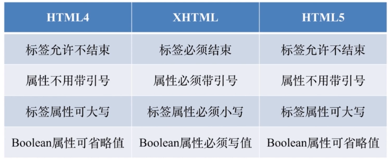

# HTML 基础知识

### 常见元素

#### head

- meta

  ```html
   <!-- 指定页面字符集 -->
  <meta charset="UTF-8"> 
  
   <!-- 指定视口参数,适配移动端的第一步 -->
   <meta name="viewport" content="width=device-width, user-scalable=no, initial-scale=1.0, maximum-scale=1.0, minimum-scale=1.0">
  ```

- title

- style

- link

- script

- base

  ```html
  <!-- 指定基础路径 -->
  <base src='/'>
  ```


#### body

- div / section /article / aside / header / footer
- p
- span / em /strong
- table / thead / tbody / tr / td 
- ul / ol / li / dl / dt / dd
- a
  - herf : 链接地址
  - target：打开方式
    - _blank: 新的页面进行打开
- img
  - arc
  - alt
- form / input / select / textarea / button
  - target
  - method
  - enctype
- label
  - for


#### 元素分类

- 按默认样式分类
  - 块级元素 block
  - 行内元素 inline
  - 行内块元素 inline-block
- 按内容分类  [W3C文档](!https://html.spec.whatwg.org/multipage/dom.html#content-models)


### 理解 HTML

- [h50.github.com](!http://h5o.github.io/)


### HTML 版本

- HTML4 
- XHTML(XML)
- HTML5




### HTML5 新增功能

- 新增区块标签
  - section
  - article
  - nav
  - aside
- 表单增强
  - 日期、时间、搜索
  - 表单验证
  - placeholder 自动聚焦
- 语义变化
  - header / footer 头尾
  - section / article 区块
  - nav 导航
  - aside 不重要内容
  - em / strong 强调
  - i  icon


### HTML 元素嵌套关系

- 块级元素可以包含行内元素
- 块级元素不一定能包含块级元素
  - 比如 `p` 元素不能包含 `div` 元素
- 行内元素一般不能包含块级元素
  - `a` 元素可以包含 `div` 元素，HTML5中计算嵌套合法性时，会直接`transparent`


### HTML 元素的默认样式

- CSS Reset

  - 方式1

  ```css
  /* http://meyerweb.com/eric/tools/css/reset/ 
     v2.0 | 20110126
     License: none (public domain)
  */
  
  html, body, div, span, applet, object, iframe,
  h1, h2, h3, h4, h5, h6, p, blockquote, pre,
  a, abbr, acronym, address, big, cite, code,
  del, dfn, em, img, ins, kbd, q, s, samp,
  small, strike, strong, sub, sup, tt, var,
  b, u, i, center,
  dl, dt, dd, ol, ul, li,
  fieldset, form, label, legend,
  table, caption, tbody, tfoot, thead, tr, th, td,
  article, aside, canvas, details, embed, 
  figure, figcaption, footer, header, hgroup, 
  menu, nav, output, ruby, section, summary,
  time, mark, audio, video {
  	margin: 0;
  	padding: 0;
  	border: 0;
  	font-size: 100%;
  	font: inherit;
  	vertical-align: baseline;
  }
  /* HTML5 display-role reset for older browsers */
  article, aside, details, figcaption, figure, 
  footer, header, hgroup, menu, nav, section {
  	display: block;
  }
  body {
  	line-height: 1;
  }
  ol, ul {
  	list-style: none;
  }
  blockquote, q {
  	quotes: none;
  }
  blockquote:before, blockquote:after,
  q:before, q:after {
  	content: '';
  	content: none;
  }
  table {
  	border-collapse: collapse;
  	border-spacing: 0;
  }
  ```

  - 方式2：

  ```css
  * {
  	margin: 0;
  	padding: 0;
  }
  ```

  


