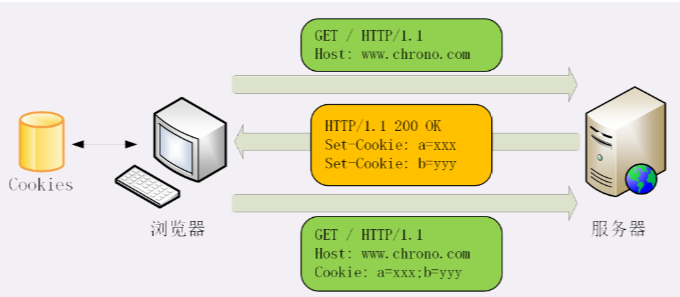

# Cookie

## 工作流程

- 浏览器负责转储，而非操作系统，只在浏览器有效

## Cookie 属性

### Expires  

“**Expires**”俗称“过期时间”，用的是绝对时间点，可以理解为“截止日期”（deadline）。

### Max-Age

**Max-Age**”用的是相对时间，单位是秒，浏览器用收到报文的时间点再加上 Max-Age，就可以得到失效的绝对时间。

Expires 和 Max-Age 可以同时出现，两者的失效时间可以一致，也可以不一致，但浏览器会优先采用 Max-Age 计算失效期。

### **Domain**和**Path**

指定了 Cookie 所属的域名和路径，浏览器在发送 Cookie 前会从 URI 中提取出 host 和 path 部分，对比 Cookie 的属性。如果不满足条件，就不会在请求头里发送 Cookie。

### **HttpOnly**

告诉浏览器，此 Cookie 只能通过浏览器 HTTP 协议传输，禁止其他方式访问，浏览器的 JS 引擎就会禁用 document.cookie 等一切相关的 API。

### **SameSite**

“**SameSite**”可以防范“跨站请求伪造”（XSRF）攻击，设置成“SameSite=Strict”可以严格限定 Cookie 不能随着跳转链接跨站发送，而“SameSite=Lax”则略宽松一点，允许 GET/HEAD 等安全方法，但禁止 POST 跨站发送。

### **Secure**

表示这个 Cookie 仅能用 HTTPS 协议加密传输，明文的 HTTP 协议会禁止发送。但 Cookie 本身不是加密的，浏览器里还是以明文的形式存在。

