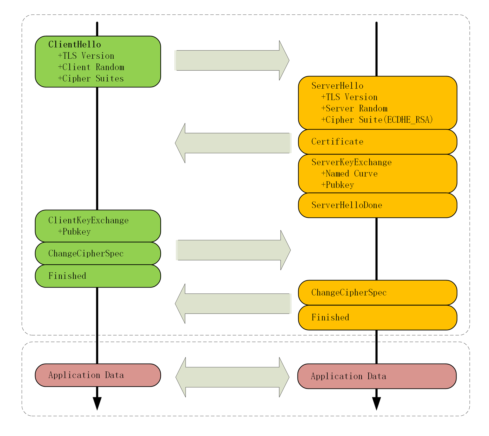

# HTTPS

## TLS 的组成

**记录协议**（Record Protocol）规定了 TLS 收发数据的基本单位：记录（record）。它有点像是 TCP 里的 segment，所有的其他子协议都需要通过记录协议发出。但多个记录数据可以在一个 TCP 包里一次性发出，也并不需要像 TCP 那样返回 ACK。

**警报协议**（Alert Protocol）的职责是向对方发出警报信息，有点像是 HTTP 协议里的状态码。比如，protocol_version 就是不支持旧版本，bad_certificate 就是证书有问题，收到警报后另一方可以选择继续，也可以立即终止连接。

**握手协议**（Handshake Protocol）是 TLS 里最复杂的子协议，要比 TCP 的 SYN/ACK 复杂的多，浏览器和服务器会在握手过程中协商 TLS 版本号、随机数、密码套件等信息，然后交换证书和密钥参数，最终双方协商得到会话密钥，用于后续的混合加密系统。

**变更密码规范协议**（Change Cipher Spec Protocol），它非常简单，就是一个“通知”，告诉对方，后续的数据都将使用加密保护。那么反过来，在它之前，数据都是明文的。

## TLS1.2

## TLS1.3

## HTTPS 优化

### 硬件优化

- CPU 指令
- SSL 加速卡
- SSL 加速服务器

### 软件优化

- 软件升级
- 协议优化

### 协议优化

- TLS 1.3
- 优先选择高性能的加密协议套件