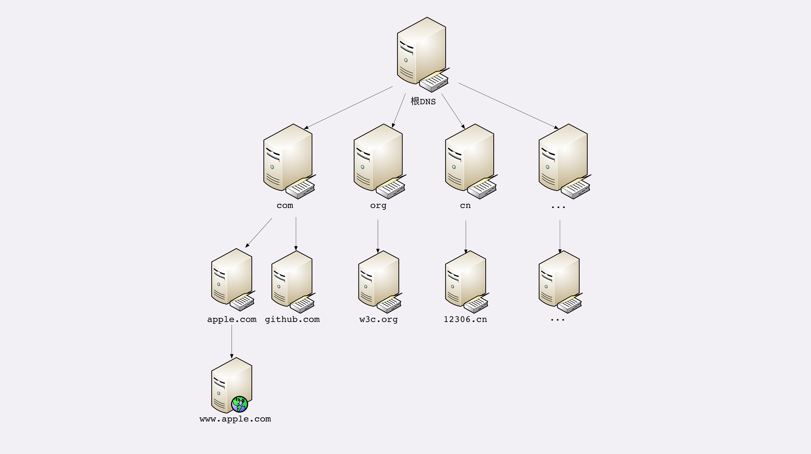

# HTTP 概览

## 什么是HTTP

### 

### 协议

- 协议必须要有两个或多个参与者，也就是“协”。
- 协议是对参与者的一种行为约定和规范，也就是“议”。

HTTP 是一个用在计算机世界里的协议。它使用计算机能够理解的语言确立了一种计算机之间交流通信的规范，以及相关的各种控制和错误处理方式。

### 传输

- HTTP 协议是一个“**双向协议**”
- 允许中间有“中转”或者“接力”

HTTP 是一个在计算机世界里专门用来在两点之间传输数据的约定和规范。

### 超文本

所谓“**超文本**”，就是“超越了普通文本的文本”，它是文字、图片、音频和视频等的混合体，最关键的是含有“超链接”，能够从一个“超文本”跳跃到另一个“超文本”，形成复杂的非线性、网状的结构关系。

HTTP 是一个在计算机世界里专门在两点之间传输文字、图片、音频、视频等超文本数据的约定和规范。

### 总结

1. HTTP 是一个用在计算机世界里的协议，它确立了一种计算机之间交流通信的规范，以及相关的各种控制和错误处理方式。
2. HTTP 专门用来在两点之间传输数据，不能用于广播、寻址或路由。
3. HTTP 传输的是文字、图片、音频、视频等超文本数据。
4. HTTP 是构建互联网的重要基础技术，它没有实体，依赖许多其他的技术来实现，但同时许多技术也都依赖于它。

## CDN

**CDN**，全称是“Content Delivery Network”，翻译过来就是“内容分发网络”。它应用了 HTTP 协议里的缓存和代理技术，代替源站响应客户端的请求。

简单来说，它可以缓存源站的数据，让浏览器的请求不用“千里迢迢”地到达源站服务器，直接在“半路”就可以获取响应。如果 CDN 的调度算法很优秀，更可以找到离用户最近的节点，大幅度缩短响应时间。

CDN 也是现在互联网中的一项重要基础设施，除了基本的网络加速外，还提供负载均衡、安全防护、边缘计算、跨运营商网络等功能，能够成倍地“放大”源站服务器的服务能力，很多云服务商都把 CDN 作为产品的一部分，我也会在后面用一讲的篇幅来专门讲解 CDN。

## URI/URL

URI（**U**niform **R**esource **I**dentifier），中文名称是 **统一资源标识符**，使用它就能够唯一地标记互联网上资源。

URI 另一个更常用的表现形式是 URL（**U**niform **R**esource **L**ocator）， **统一资源定位符**，也就是我们俗称的“网址”，它实际上是 URI 的一个子集，不过因为这两者几乎是相同的，差异不大，所以通常不会做严格的区分。

## HTTPS

全称是“**HTTP over SSL/TLS**”。

SSL 的全称是“**S**ecure **S**ocket **L**ayer”，由网景公司发明，当发展到 3.0 时被标准化，改名为 TLS，即“**T**ransport **L**ayer **S**ecurity”，但由于历史的原因还是有很多人称之为 SSL/TLS，或者直接简称为 SSL。

## 代理

1. 匿名代理：完全“隐匿”了被代理的机器，外界看到的只是代理服务器；
2. 透明代理：顾名思义，它在传输过程中是“透明开放”的，外界既知道代理，也知道客户端；
3. 正向代理：靠近客户端，代表客户端向服务器发送请求；
4. 反向代理：靠近服务器端，代表服务器响应客户端的请求；

## 网路模型

### TCP/IP 网络分层模型

### OSI 网络分层模型

1. 第一层：物理层，网络的物理形式，例如电缆、光纤、网卡、集线器等等；
2. 第二层：数据链路层，它基本相当于 TCP/IP 的链接层；
3. 第三层：网络层，相当于 TCP/IP 里的网际层；
4. 第四层：传输层，相当于 TCP/IP 里的传输层；
5. 第五层：会话层，维护网络中的连接状态，即保持会话和同步；
6. 第六层：表示层，把数据转换为合适、可理解的语法和语义；
7. 第七层：应用层，面向具体的应用传输数据。

## 域名

### 域名的形式

域名是一个有层次的结构，是一串用“.”分隔的多个单词，最右边的被称为“顶级域名”，然后是“二级域名”，层级关系向左依次降低。最左边的是主机名，通常用来表明主机的用途。

域名本质上还是个名字空间系统，使用多级域名就可以划分出不同的国家、地区、组织、公司、部门，每个域名都是独一无二的，可以作为一种身份的标识。

### 域名解析

就像 IP 地址必须转换成 MAC 地址才能访问主机一样，域名也必须要转换成 IP 地址，这个过程就是“**域名解析**”。

DNS 的核心系统是一个三层的树状、分布式服务，基本对应域名的结构：

1. 根域名服务器（Root DNS Server）：管理顶级域名服务器，返回“com”“net”“cn”等顶级域名服务器的 IP 地址；
2. 顶级域名服务器（Top-level DNS Server）：管理各自域名下的权威域名服务器，比如 com 顶级域名服务器可以返回 apple.com 域名服务器的 IP 地址；
3. 权威域名服务器（Authoritative DNS Server）：管理自己域名下主机的 IP 地址，比如 apple.com 权威域名服务器可以返回 www.apple.com 的 IP 地址。

### 其他应用

- “重定向”。因为域名代替了 IP 地址，所以可以让对外服务的域名不变，而主机的 IP 地址任意变动。当主机有情况需要下线、迁移时，可以更改 DNS 记录，让域名指向其他的机器。
- 因为域名是一个名字空间，所以可以使用 bind9 等开源软件搭建一个在内部使用的 DNS，作为名字服务器。
- 基于域名实现的负载均衡。