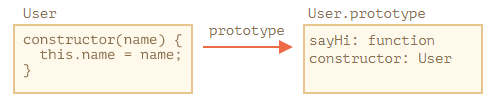
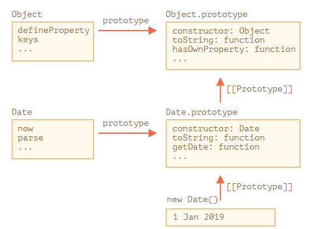

# class

## 什么是 class

```javascript
class User {
  classField = "类字段";

  constructor(name) { this.name = name; }
  sayHi() { alert(this.name); }
}

// 佐证：User 是一个函数
alert(typeof User); // function
```

class User {...} 构造实际上做了如下的事儿：



- 建一个名为 User 的函数，该函数成为类声明的结果，该函数的代码来自于 constructor
- 存储类中的方法

### 与普通的构造函数区别

- 通过 class 创建的函数具有特殊的内部属性标记 [[FunctionKind]]:"classConstructor"
- 调用类构造器时必须要用 new 关键词
- 类方法不可枚举，类定义将 "prototype" 中的所有方法的 enumerable 标志设置为 false
- 类总是使用 use strict。 在类构造中的所有代码都将自动进入严格模式

### class 字段

- “类字段”是一种允许添加任何属性的语法。上面例子中的 classField 字段
- 类字段设置在单个对象上的，而不是设置在类的原型对象上的
- 在 constructor 完成工作后被处理的

### 语法总结

```javascript
class MyClass {
  prop = value; // 属性

  constructor(...) { // 构造器
    // ...
  }

  method(...) {} // method

  get something(...) {} // getter 方法
  set something(...) {} // setter 方法

  [Symbol.iterator]() {} // 有计算名称（computed name）的方法（此处为 symbol）
  // ...
}
```

## 类继承

### super

- 执行 super.method(...) 来调用一个父类方法
- 执行 super(...) 来调用一个父类 constructor（只能在我们的 constructor 中）
- 箭头函数没有 super，如果被访问，它会从外部函数获取

### 重写 constructor

继承类的 constructor 必须调用 super(...)，并且一定要在使用 this 之前调用。原因如下：

- 派生构造器具有特殊的内部属性 [[ConstructorKind]]:"derived"。这是一个特殊的内部标签
- 当通过 new 执行一个常规函数时，它将创建一个空对象，并将这个空对象赋值给 this。
- 但是当继承的 constructor 执行时，它不会执行此操作。它期望父类的 constructor 来完成这项工作。

## 静态属性和静态方法

```javascript
class User {
  static publisher = "Levi Ding";
  static staticMethod() {
    console.log(this === User);
  }
}

User.staticMethod(); // true
console.log( Article.publisher ); // Levi Ding
```

### 静态属性和方法是可被继承的

```javascript
class Animal {}
class Rabbit extends Animal {}

// 对于静态的
alert(Rabbit.__proto__ === Animal); // true

// 对于常规方法
alert(Rabbit.prototype.__proto__ === Animal.prototype); // true
```

不过内建类没有静态方法继承。



## instanceof

instanceof 操作符用于检查一个对象是否属于某个特定的 class。同时，它还考虑了继承。

obj instanceof Class 算法的执行过程大致如下：

- 如果这儿有静态方法 Symbol.hasInstance，那就直接调用这个方法：

```javascript
// 设置 instanceOf 检查
// 并假设具有 canEat 属性的都是 animal
class Animal {
  static [Symbol.hasInstance](obj) {
    if (obj.canEat) return true;
  }
}

let obj = { canEat: true };

alert(obj instanceof Animal); // true：Animal[Symbol.hasInstance](obj) 被调用
```

- typeof：用于原始数据类型，返回 string
- {}.toString：用于原始数据类型，内建对象，包含 Symbol.toStringTag 属性的对象，返回 string
- instanceof：用于对象，返回 true/false

## Mixin

mixin 是一个包含可被其他类使用而无需继承的方法的类。

案例:

```javascript
let sayMixin = {
  say(phrase) {
    console.log(phrase);
  }
};

let sayHiMixin = {
  __proto__: sayMixin, // (或者，我们可以在这儿使用 Object.create 来设置原型)

  sayHi() {
    // 调用父类方法
    super.say(`Hello ${this.name}`); // (*)
  },
  sayBye() {
    super.say(`Bye ${this.name}`); // (*)
  }
};

class User {
  constructor(name) {
    this.name = name;
  }
}

// 拷贝方法
Object.assign(User.prototype, sayHiMixin);

// 现在 User 可以打招呼了
new User("Dude").sayHi(); // Hello Dude!
```
