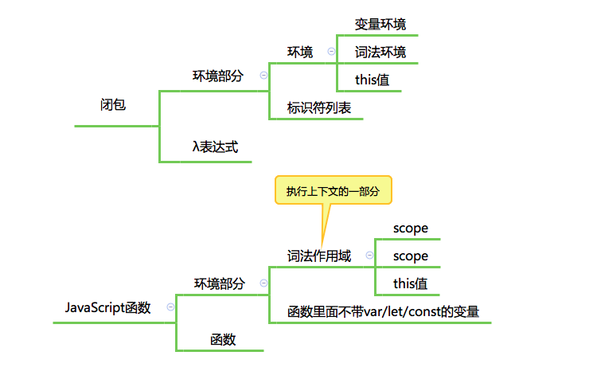

## JavaScript 的执行

## 事件循环

JavaScript 引擎等待宿主环境分配宏观任务，在操作系统中，通常等待的行为都是一个事件循环，所以在 Node 术语中，也会把这个部分称为事件循环。

大概是这样的：

```javascript
while(TRUE) {
    r = wait();
    execute(r);
}
```


## 闭包



### 组成

- 环境部分
  - 环境：函数的词法环境
  - 标识符列表：函数中用到的未声明的变量
- 表达式部分：函数体
