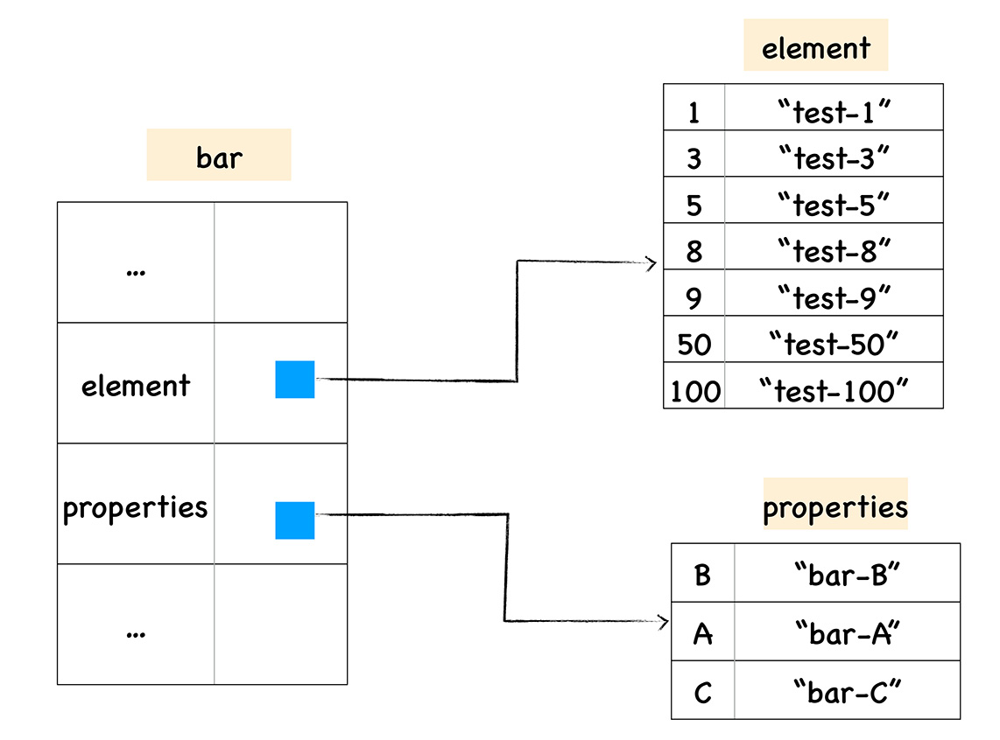

# JavaScript 对象

## JavaScript 对象两类属性

对 JavaScript 来说，属性并非只是简单的名称和值，JavaScript 用一组特征（attribute）来描述属性（property）。实际上 JavaScript 对象的运行时是一个“属性的集合”，属性以字符串或者 Symbol 为 key，以数据属性特征值或者访问器属性特征值为 value。

### 数据属性

- value： 就是属性的值
- writable： 决定属性能否被赋值
- enumerable： 决定 `for in` 能否枚举该属性
- configurable：决定该属性能否被删除或者改变特征值

### 访问器属性

- getter： 函数或 undefined，在取属性值时被调用
- setter：函数或 undefined，在设置属性值时被调用
- enumerable： 决定 `for in` 能否枚举该属性
- configurable：决定该属性能否被删除或者改变特征值

### 定义 / 查看属性的特征

```javascript
// 定义对象属性
var o = { a: 1 };
o.b = 2;
Object.defineProperty(o, "c", {
  value: 3,
  writable: false,
  enumerble:false,
  configurable: true,
});

// 查看对象属性
Object.getOwnPropertyDescriptor(o,"a") // {value: 1, writable: true, enumerable: true, configurable: true}
Object.getOwnPropertyDescriptor(o,"b") // {value: 2, writable: true, enumerable: true, configurable: true}
Object.getOwnPropertyDescriptor(o,"c") // {value: 2, writable: false, enumerable: false, configurable: true}

o.c = 100;
console.log(o.c); // 3
Object.keys(o); // ['a', 'b']
```

## JavaScript 的原型

两句话概括：

- 如果所有对象都有私有字段[[prototype]]，就是对象的原型
- 读一个属性，如果对象本身没有，则会继续访问对象的原型，直到原型为空或者找到为止

ES6 中提供的直接访问和操纵原型的方法：

- `Object.create` 根据指定的原型创建新的对象，原型可以是 `null`
- `Object.getPrototypeOf` 获得一个对象的原型
- `Object.setPrototypeOf` 设置一个对象的原型

## 对象分类

### 宿主对象

- 固有：如 window
- 用户可创建：如 `document.createElement`  创建的 `DOM` 对象

### 内置对象

- 固有对象：由标准规定，随着 JavaScript 运行时创建而自动创建的对象实例

- 原生对象：可以由用户通过 Array、RegExp 等内置构造器或者特殊语法创建的对象

  

- 普通对象：由{}语法、Object 构造器或者 class 关键字定义类创建的对象，它能够被原型继承

## 函数的本质


函数除了可以拥有常用类型的属性值之外，还拥有两个隐藏属性，分别是 name 属性和 code 属性。

如果某个函数没有设置函数名，name 属性的值就是 `anonymous`，code 属性就是函数代码，以字符串的形式存储在内存。

## V8 如何存储对象
> [博客](https://www.cnblogs.com/chargeworld/p/12236848.html)

### 排序属性和常规属性

ECMAScript 规范中定义了对象的数字属性应该按照索引值大小升序排列，字符串属性根据创建时的顺序升序排列。

我们把对象中的数字属性称为排序属性，在 V8 中被称为 elements，字符串属性就被称为常规属性，在 V8 中被称为 properties。



### 快属性和慢属性

#### 对象内属性

执行 bar.B这个语句来查找 B 的属性值，那么在 V8 会先查找出 properties 属性所指向的对象 properties，然后再在 properties 对象中查找 B 属性，这种方式在查找过程中增加了一步操作，因此会影响到元素的查找效率。

V8 采取了一个权衡的策略以加快查找属性的效率，这个策略是将部分常规属性直接存储到对象本身，我们把这称为对象内属性 (in-object properties)。

不过对象内属性的数量是固定的，默认是 10 个，如果添加的属性超出了对象分配的空间，则它们将被保存在常规属性存储中。虽然属性存储多了一层间接层，但可以自由地扩容。

#### 快属性策略

我们将保存在线性数据结构中的属性称之为“快属性”，因为线性数据结构中只需要通过索引即可以访问到属性，虽然访问线性结构的速度快，但是如果从线性结构中添加或者删除大量的属性时，则执行效率会非常低，这主要因为会产生大量时间和内存开销。

#### 慢属性策略

如果一个对象的属性过多时，V8 就会采取另外一种存储策略，那就是“慢属性”策略，但慢属性的对象内部会有独立的非线性数据结构 (词典) 作为属性存储容器。所有的属性元信息不再是线性存储的，而是直接保存在属性字典中。


## 其他

函数对象的定义是：具有[[call]]私有字段的对象

构造器对象的定义是：具有私有字段[[construct]]的对象，ES6 箭头语法创建的仅仅是函数，是没法当作构造器来使用的

`[[construct]]` 的执行过程：

- 以 `Object.prototype` 为原型创建一个新对象
- 以新对象为 `this`，执行函数的 `[[call]]`
- 如果 `[[call]]` 的返回值为对象，那么返回这个对象，否则返回第一步创建的对象

特殊行为的对象：

- Array：Array 的 length 属性根据最大的下标自动发生变化。
- Object.prototype：作为所有正常对象的默认原型，不能再给它设置原型了。
- String：为了支持下标运算，String 的正整数属性访问会去字符串里查找。
- Arguments：arguments 的非负整数型下标属性跟对应的变量联动。
- 模块的 namespace 对象：特殊的地方非常多，跟一般对象完全不一样，尽量只用于 import 吧。
- 类型数组和数组缓冲区：跟内存块相关联，下标运算比较特殊。
- bind 后的 function：跟原来的函数相关联。

