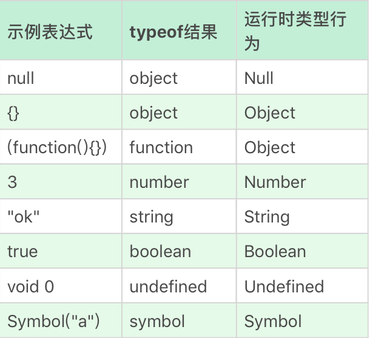

# JavaScript 数据类型

## Undefined

- 表示的未定义
- 任何变量赋值前都是 `Undefined` 值
- `undefined` 是一个变量而不是一个关键字，存在被无意串改的可能
- 可以通过 `void 0` 来获取 `undefined` 的值

## Null

- 表示空值，定义了但是值为空
- `null` 是 `Javascript` 关键字

## Boolean

## String

- 表示文本数据，有最大长度为 `2^53-1`
- 使用的是字符串的 `UTF16` 编码
- 字符串永远无法变更，具有值类型的特征
- 把每个 `UTF16` 单元当作一个字符处理

## Number

- 有一定的精度范围

- [NaN](https://developer.mozilla.org/zh-CN/docs/Web/JavaScript/Reference/Global_Objects/NaN) ：表示不是一个数字，是一个**全局对象的属性**（ES5 以上中，`NaN` 是一个不可配置，不可写的属性）， ES3 中有被更改或者覆盖的可能。NaN 是粘性的，任何对 NaN 的进一步操作都会返回 NaN。

  ```javascript
  NaN === NaN;        // false
  Number.NaN === NaN; // false
  isNaN(NaN);         // true
  isNaN(Number.NaN);  // true
  
  function valueIsNaN(v) { return v !== v; }
  valueIsNaN(1);          // false
  valueIsNaN(NaN);        // true
  valueIsNaN(Number.NaN); // true
  
  isNaN('hello world');        // true
  Number.isNaN('hello world'); // false
  ```

- `Infinity` 和 `-Infinity` 分别表示正负无穷大

- `JavaScript` 是区分 `+0` 和 `-0` 的，检测办法是计算 `1/x`

  ```javascript
  -0 === 0           // true
  1 / -0 === 1 / 0   // false
  1  / 0             // Infinity
  -1 / 0             // -Infinity
  ```

- 浮点数 `==` 或者 `===` 的比较，浮点数运算的精度问题导致等式左右的结果并不是严格相等，而是相差了个微小的值。[**`Number.EPSILON`**](https://developer.mozilla.org/zh-CN/docs/Web/JavaScript/Reference/Global_Objects/Number/EPSILON) 属性表示 1 与`Number`可表示的大于 1 的最小的浮点数之间的差值。

  ```javascript
  0.1 + 0.2 == 0.3 // false
  Math.abs(0.1 + 0.2 - 0.3) <= Number.EPSILON // true
  ```

## Symbol

- 一切非字符串的对象 `key` 的集合

## BigInt

在 JavaScript 中，“number” 类型无法表示大于 (253-1)（即 9007199254740991），或小于 -(253-1) 的整数。这是其内部表示形式导致的技术限制。
BigInt 类型是最近被添加到 JavaScript 语言中的，用于表示任意长度的整数。

## Object

- 一切有形和无形物体的总称，是属性的集合

- Number、String 和 Boolean，三个构造器是两用的，当跟 new 搭配时，它们产生对象，当直接调用时，它们表示强制类型转换。

  ```javascript
  var s0 = 'hello'; // 基本数据类型 String
  var s1 = new String(s0); // object 类型
  var s2 = String(s0); // 基本数据类型 String
  
  s1 === s2 // false
  s1 === s0 // false
  s2 === s0 // true
  ```

- 之所以基本数据类型能进行方法调用，是因为运算符提供了装箱操作，它会根据基础类型构造一个临时对象，使得我们能在基础类型上调用对应对象的方法。

## 类型转换

### 转换规则

  

### typeof  规则

```javascript
typeof undefined // "undefined"
typeof 0 // "number"
typeof 10n // "bigint"
typeof true // "boolean"
typeof "foo" // "string"
typeof Symbol("id") // "symbol"
typeof Math // "object"  (1)
typeof null // "object"  (2)
typeof alert // "function"  (3)
```



- Math 是一个提供数学运算的内建 object
- typeof null 的结果是 "object"，但是 null 绝对不是一个 object。null 有自己的类型，它是一个特殊值。
- typeof alert 的结果是 "function"，但是在 JavaScript 语言中没有一个特别的 “function” 类型。函数隶属于 object 类型。

### `StringToNumber`

- `Number()` 支持科学计数法，`parseInt` 和 `parseFloat` 不支持

- 任何情况下都建议传入 `parseInt` 的第二个参数（可能存在歧义）

    ```javascript
    parseInt('0xf') // 15 默认支持16进制前缀
    parseInt('0xf', 10) // 0
    ```

- 多数情况下，Number 是比 parseInt 和 parseFloat 更好的选择

### `NumberToString`

### 装箱转换

- 每一种基本类型 `Number`、`String`、`Boolean`、`Symbol` 在对象中都有对应的类，所谓装箱转换，正是把基本类型转换为对应的对象，它是类型转换中一种相当重要的种类

- `Symbol` 函数没有办法通过 `new` 调用，但可以通过下面这种方式创建 `Symbol` 类的实例

    ```javascript
    var symbolObject = (function(){ return this; }).call(Symbol("a"));
    // 或者
    var symbolObject = Object(Symbol("a"));

    console.log(typeof symbolObject); //object
    console.log(symbolObject instanceof Symbol); //true
    console.log(symbolObject.constructor == Symbol); //true
    ```

- 每一个装箱对象都有私有的 `class` 属性，可以通过 `Object.prototype.toString` 来获取

### 拆箱转换

- 在 `JavaScript` 标准中，规定了 `ToPrimitive` 函数，它是对象类型到基本类型的转换（即拆箱转换）

- 对象到 `String` 和 `Number` 的转换都遵循“先拆箱再转换”的规则，类型转换的内部实现是通过 `ToPrimitive ( input [ , PreferredType ] )` 方法进行转换的，这个方法的作用就是将 `input` 转换成一个非对象类型

    ```javascript
    var o = {
        valueOf : () => {console.log("valueOf"); return {}},
        toString : () => {console.log("toString"); return {}}
    }
    o * 2
    // valueOf
    // toString
    // TypeError

    var o = {
        valueOf : () => {console.log("valueOf"); return {}},
        toString : () => {console.log("toString"); return {}}
    }
    String(o)
    // toString
    // valueOf
    // TypeError

    var o = {
        valueOf : () => {console.log("valueOf"); return {}},
        toString : () => {console.log("toString"); return {}}
    }
    // 在 ES6 之后，还允许对象通过显式指定 @@toPrimitive Symbol 来覆盖原有的行为
    o[Symbol.toPrimitive] = () => {console.log("toPrimitive"); return "hello"}
    console.log(o + "")
    // toPrimitive
    // hello
    ```
