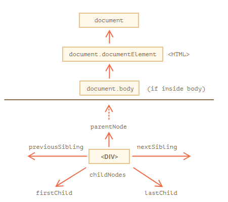
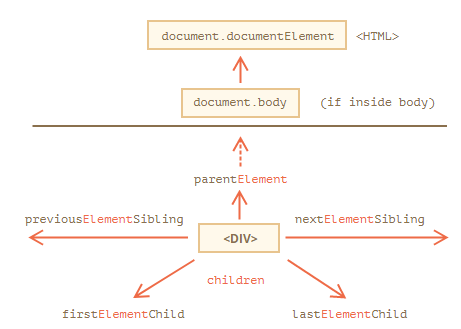
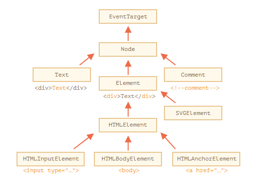
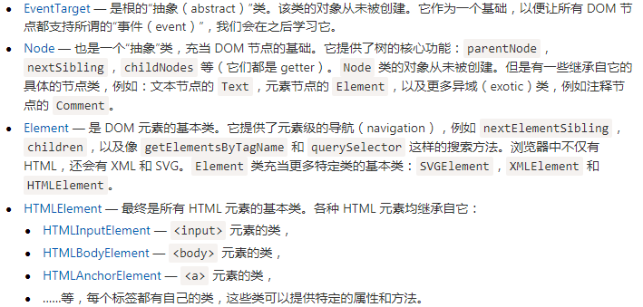
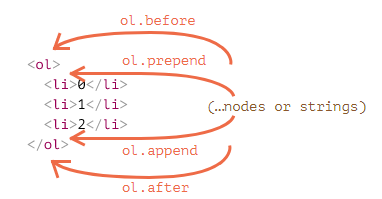
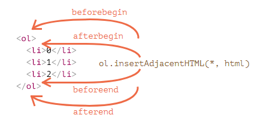

# Dom

## 浏览器环境

### 文档对象模型（DOM）

文档对象模型（Document Object Model），简称 DOM，将所有页面内容表示为可以修改的对象。

### 浏览器对象模型（BOM）

浏览器对象模型（Browser Object Model），简称 BOM，表示由浏览器（主机环境）提供的用于处理文档（document）之外的所有内容的其他对象。

常用的:

- navigator 对象提供了有关浏览器和操作系统的背景信息。
  - navigator.userAgent — 关于当前浏览器
  - navigator.platform — 关于平台
- location 对象允许我们读取当前 URL，并且可以将浏览器重定向到新的 URL。

### 规范

- DOM 规范：描述文档的结构、操作和事件
- CSSOM 规范：描述样式表和样式规则，对它们进行的操作，以及它们与文档的绑定
- HTML 规范：描述 HTML 语言（例如标签）以及 BOM（浏览器对象模型）— 各种浏览器函数：setTimeout，alert，location 等

## Dom 遍历



### 最顶层的元素

```javascript
<html> = document.documentElement
<body> = document.body
<head> = document.head
```

- dom 中 null 表示不存在这个节点
- document.body 可能是 null，脚本无法访问在运行时不存在的元素。

```html
<html>

<head>
  <script>
    alert( "From HEAD: " + document.body ); // null，这里目前还没有 <body>
  </script>
</head>

<body></body>
</html>
```

### 子节点

- childNodes 集合列出了所有子节点，包括文本节点。
- firstChild 和 lastChild 属性是访问第一个和最后一个子元素的快捷方式
- elem.hasChildNodes() 用于检查节点是否有子节点

### 兄弟节点和父节点

- previousSibling，nextSibling  — 兄弟节点
- parentNode — 父节点

### 纯元素



- children — 仅那些作为元素节点的子代的节点
- document 不是一个元素节点

```js
console.log( document.documentElement.parentNode ); // document
console.log( document.documentElement.parentElement ); // null
```

## 搜索

### document.getElementById

只有 document.getElementById，没有 anyElem.getElementById

### elem.getElementsByTagName(tag)

具有给定标签的元素，并返回它们的集合。tag 参数也可以是对于“任何标签”的星号 "*"

### elem.getElementsByClassName(className)

### document.getElementsByName(name)

### elem.querySelectorAll(css)

返回 elem 中与给定 CSS 选择器匹配的所有元素

### elem.querySelector(css)

返回给定 CSS 选择器的第一个元素

### elem.matches(css)

检查 elem 是否与给定的 CSS 选择器匹配。返回 true 或 false

### elem.closest(css)

查找与 CSS 选择器匹配的最近的祖先。elem 自己也会被搜索

### 实时性

- 所有的 "getElementsBy*" 方法都会返回一个 **实时的（live）** 集合
- querySelectorAll 返回的是一个 **静态的** 集合

```html
<div>First div</div>

<script>
  let divs1 = document.getElementsByTagName('div');
  let divs2 = document.querySelectorAll('div');
  alert(divs1.length); // 1
  alert(divs2.length); // 1
</script>

<div>Second div</div>

<script>
  alert(divs1.length); // 2
  alert(divs2.length); // 1
</script>
```

## 节点属性




- HTMLElement — 它提供了通用（common）的 HTML 元素方法（以及 getter 和 setter）
- Element — 提供通用（generic）元素方法
- Node — 提供通用 DOM 节点属性
- EventTarget — 为事件（包括事件本身）提供支持

```js
console.log( document.body instanceof HTMLBodyElement ); // true
console.log( document.body instanceof HTMLElement ); // true
console.log( document.body instanceof Element ); // true
console.log( document.body instanceof Node ); // true
console.log( document.body instanceof EventTarget ); // true
```

### nodeType

[nodeType](https://dom.spec.whatwg.org/#node) 属性提供了另一种“过时的”用来获取 DOM 节点类型的方法

### nodeName 和 tagName

- 给定一个 DOM 节点，我们可以从 nodeName 或者 tagName 属性中读取它的标签名
- tagName 属性仅适用于 Element 节点
- nodeName 是为任意 Node 定义的
  - 对于元素，它的意义与 tagName 相同
  - 对于其他节点类型（text，comment 等），它拥有一个对应节点类型的字符串

### innerHTML

属性允许将元素中的 HTML 获取为字符串形式，仅对元素节点有效

#### 脚本不会执行

如果 innerHTML 将一个 `<script>` 标签插入到 document 中 — 会成为 HTML 的一部分，但是不会执行

#### “innerHTML+=” 会进行完全重写

### outerHTML

outerHTML 属性包含了元素的完整 HTML

#### 与 innerHTML 不同，写入 outerHTML 不会改变元素。而是在 DOM 中替换它

```html
<div>Hello, world!</div>

<script>
  let div = document.querySelector('div');

  // 使用 <p>...</p> 替换 div.outerHTML
  div.outerHTML = '<p>A new element</p>'; // (*)

  // 蛤！'div' 还是原来那样！
  alert(div.outerHTML); // <div>Hello, world!</div> (**)
</script>
```

### nodeValue 和 data

innerHTML 属性仅对元素节点有效，其他类型的节点使用 nodeValue 和 data 属性，这两个属性是基本一样的，一般使用 data

### textContent

仅文本，去掉所有 `<tags>`

textContent 允许以“安全方式”写入文本

```html
<div id="elem1"></div>
<div id="elem2"></div>

<script>
  let name = prompt("What's your name?", "<b>Winnie-the-pooh!</b>");

  elem1.innerHTML = name;
  elem2.textContent = name;
</script>
```

### hidden

“hidden” 特性（attribute）和 DOM 属性（property）指定元素是否可见。
hidden 与 style="display:none" 做的是相同的事

## 修改文档

### 创建元素

- document.createElement(tag)
- document.createTextNode(text)

### 插入

- node.append(...nodes or strings) — 在 node 末尾 插入节点或字符串
- node.prepend(...nodes or strings) — 在 node 开头 插入节点或字符串
- node.before(...nodes or strings) — 在 node 前面 插入节点或字符串
- node.after(...nodes or strings) — 在 node 后面 插入节点或字符串
- node.replaceWith(...nodes or strings) — 将 node 替换为给定的节点或字符串



- elem.insertAdjacentHTML(where, html)
  - "beforebegin" — 将 html 插入到 elem 前插入
  - "afterbegin" — 将 html 插入到 elem 开头
  - "beforeend" — 将 html 插入到 elem 末尾
  - "afterend" — 将 html 插入到 elem 后
- elem.insertAdjacentText(where, text)
- elem.insertAdjacentElement(where, elem)



### 移除

- node.remove()

如果我们要将一个元素 移动 到另一个地方，则无需将其从原来的位置中删除，**所有插入方法都会自动从旧位置删除该节点**

### 克隆节点

- elem.cloneNode(true) 具有所有特性（attribute）和子元素
- elem.cloneNode(false) 不包括子元素

