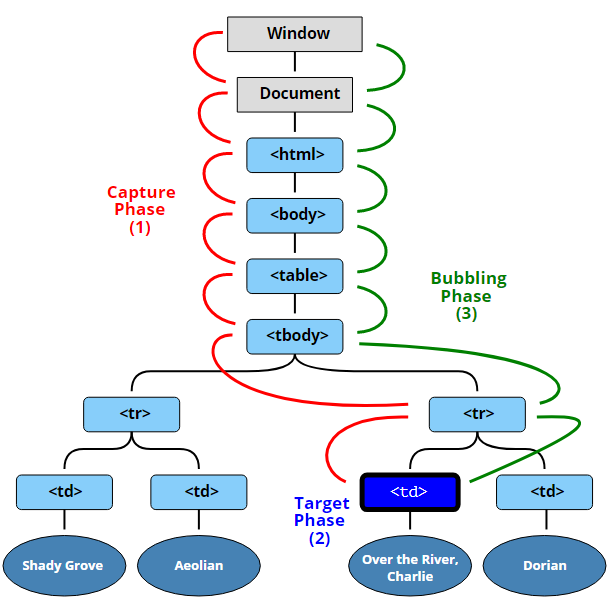
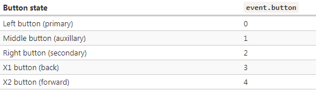
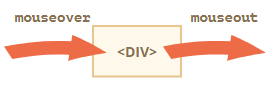

# 浏览器事件

## 常用事件类型

### 鼠标事件

- click —— 当鼠标点击一个元素时（触摸屏设备会在点击时生成）。
- contextmenu —— 当鼠标右键点击一个元素时。
- mouseover / mouseout —— 当鼠标指针移入/离开一个元素时。
- mousedown / mouseup —— 当在元素上按下/释放鼠标按钮时。
- mousemove —— 当鼠标移动时。

### 键盘事件

- keydown and keyup – 键盘按下/松开

### 表单（form）元素事件

- submit —— 当访问者提交了一个 `<form>` 时。
- focus —— 当访问者聚焦于一个元素时，例如聚焦于一个 `<input>`

### Document 事件

- DOMContentLoaded —— 当 HTML 的加载和处理均完成，DOM 被完全构建完成时

### CSS 事件

- transitionend —— 当一个 CSS 动画完成时

## addEventListener

`element.addEventListener(event, handler[, options])`

- event 事件名，例如："click"
- handler 处理程序
- options
  - once：如果为 true，那么会在被触发后自动删除监听器
  - capture：事件处理的阶段。由于历史原因，options 也可以是 false/true，它与 {capture: false/true} 效果相同
  - passive：如果为 true，那么处理程序将不会调用 preventDefault()，这项配置可以减少浏览器不必要的延迟和“抖动”

对于某些事件，只能通过 addEventListener 设置处理程序，例如，DOMContentLoaded 事件，该事件在文档加载完成并且 DOM 构建完成时触发

## event 对象

- event.type 事件类型
- event.currentTarget 处理事件的元素
- event.clientX / event.clientY 指针事件（pointer event）的指针的窗口相对坐标
- event.target —— 引发事件的层级最深的元素
- event.eventPhase —— 当前阶段（capturing=1，target=2，bubbling=3）

### 冒泡

当一个事件发生在一个元素上，它会首先运行在该元素上的处理程序，然后运行其父元素上的处理程序，然后一直向上到其他祖先上的处理程序。

- event.target —— 是引发事件的“目标”元素，它在冒泡过程中不会发生变化
- this（=event.currentTarget） —— 是“当前”元素，其中有一个当前正在运行的处理程序

#### 停止冒泡

- event.stopPropagation 停止冒泡
- event.stopImmediatePropagation 用于停止冒泡，并阻止当前元素上的处理程序（元素在一个事件上有多个处理程序）运行

### 捕获

DOM 事件标准描述了事件传播的 3 个阶段：

1. 捕获阶段（Capturing phase）—— 事件（从 Window）向下走近元素
2. 目标阶段（Target phase）—— 事件到达目标元素
3. 冒泡阶段（Bubbling phase）—— 事件从元素上开始冒泡

### 事件委托

1. 在容器（container）上放一个处理程序
2. 在处理程序中 —— 检查源元素 event.target
3. 如果事件发生在我们感兴趣的元素内，那么处理该事件

## 浏览器默认行为

许多事件会自动触发浏览器执行某些行为

### 阻止浏览器行为

- event.preventDefault
- 如果处理程序是使用 `on<event>`（而不是 addEventListener）分配的，那返回 false 也同样有效

### event.defaultPrevented

如果默认行为被阻止，那么 event.defaultPrevented 属性为 true，否则为 false

## 自定义事件

`let event = new Event(type[, options]);`

- type —— 事件类型
- options —— 具有两个可选属性的对象
  - bubbles: true/false —— 如果为 true，那么事件会冒泡
  - cancelable: true/false —— 如果为 true，那么“默认行为”可以被阻止
  - 默认情况下，以上两者都为 false：{bubbles: false, cancelable: false}

### dispatchEvent

elem.dispatchEvent(event) 可以触发元素上的事件

#### event.isTrusted

对于来自真实用户操作的事件，event.isTrusted 属性为 true，对于脚本生成的事件，event.isTrusted 属性为 false

## UI事件

### 鼠标事件 - event.button

### 组合键

所有的鼠标事件都包含有关按下的组合键的信息,如果在事件期间按下了相应的键，则它们为 true

- event.shiftKey：Shift
- event.altKey：Alt（或对于 Mac 是 Opt）
- event.ctrlKey：Ctrl
- event.metaKey：对于 Mac 是 Cmd

### 坐标

所有的鼠标事件都提供了两种形式的坐标：

- 相对于窗口的坐标：clientX 和 clientY
- 相对于文档的坐标：pageX 和 pageY

### mouseover/mouseout 与 relatedTarget

#### mouseover

- event.target —— 是鼠标移过的那个元素
- event.relatedTarget —— 是鼠标来自的那个元素（relatedTarget → target）

#### mouseout

- event.target —— 是鼠标离开的元素
- event.relatedTarget —— 是鼠标移动到的，当前指针位置下的元素（target → relatedTarget）

> relatedTarget 可以为 null，如果 mouseover 被触发了，则必须有 mouseout

### mouseenter 和 mouseleave

- 元素内部与后代之间的转换不会产生影响
- 事件 mouseenter/mouseleave 不会冒泡
