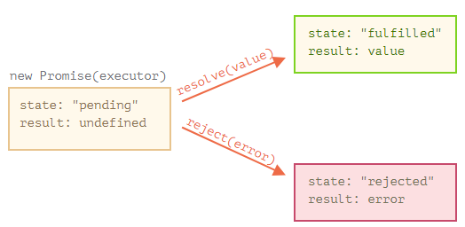

# Promise

## 构造器

```javascript
new Promise( function(resolve, reject) {...} /* executor */  );
```

### executor

当 new Promise 被创建，executor 会自动运行。

- resolve(value) — 如果任务成功完成并带有结果 value
- reject(error) — 如果出现了 error，error 即为 error 对象
- Promise 的执行者（executor）和 promise 的处理程序（handler）周围有一个“隐式的 try..catch”。如果发生异常就会被捕获，并被视为 rejection 进行处理。

### Promise 状态



- executor 只能调用一个 resolve 或一个 reject。任何状态的更改都是最终的。

## .then

```javascript
promise.then(
  function(result) { /* handle a successful result */ },
  function(error) { /* handle an error */ }
);

// .then(null, errorHandlingFunction) 等效于 .catch(errorHandlingFunction)
```

## .catch

### 对比 then 对比 catch

```javascript
promise.then(f1).catch(f2); // (a)
promise.then(f1, f2); // (b)

// 如果 f1 中出现 error，那么在 a 会被 .catch 处理，在 b 则不会。
```

## .finally

与 then 的区别：

- finally 处理程序（handler）没有参数
- finally 不知道 promise 是否成功
- finally 处理程序将结果和 error 传递给下一个处理程序

## Thenables

允许我们将自定义的对象与 promise 链集成在一起，而不必继承自 Promise。

```javascript
class Thenable {
  constructor(num) {
    this.num = num;
  }
  then(resolve, reject) {
    alert(resolve); // function() { native code }
    // 1 秒后使用 this.num*2 进行 resolve
    setTimeout(() => resolve(this.num * 2), 1000); // (**)
  }
}

new Promise(resolve => resolve(1))
  .then(result => {
    return new Thenable(result); // (*)
  })
  .then(console.log); // 1000ms 后显示 2
```

## 对比回调函数

| Promises | Callbacks |
| - | - |
| Promises 允许我们按照自然顺序进行编码 | 调用函数之前，就必须知道如何处理结果 |
| 在 promise 上多次调用 .then。每次调用，我们都会在“订阅列表”中添加一个新的“分析”，一个新的订阅函数，也就是 Promise 链条 | 只能有一个回调 |
