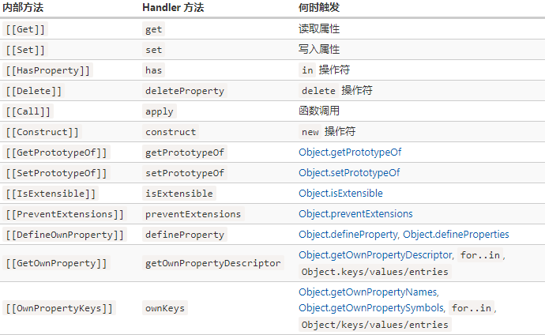

# Proxy

## 语法

```javascript
let proxy = new Proxy(target, handler)
```

- target — 是要包装的对象，可以是任何东西，包括函数。
- handler — 代理配置：带有“陷阱”



## 实例

```javascript
// get =================================
let dictionary = {
  'Hello': 'Hola',
  'Bye': 'Adiós'
};

dictionary = new Proxy(dictionary, {
  get(target, phrase) { // 拦截读取属性操作
    if (phrase in target) { //如果词典中有该短语
      return target[phrase]; // 返回其翻译
    } else {
      // 否则返回未翻译的短语
      return phrase;
    }
  }
});

// 在词典中查找任意短语！
// 最坏的情况也只是它们没有被翻译。
console.log( dictionary['Hello'] ); // Hola
console.log( dictionary['Welcome to Proxy']); // Welcome to Proxy（没有被翻译）

// set =================================
let numbers = [];

numbers = new Proxy(numbers, { // (*)
  set(target, prop, val) { // 拦截写入属性操作
    if (typeof val == 'number') {
      target[prop] = val;
      return true;  // 返回 true 表示写入成功
    } else {
      return false;
    }
  }
});

numbers.push(1); // 添加成功
numbers.push(2); // 添加成功
console.log("Length is: " + numbers.length); // 2

numbers.push("test"); // TypeError（proxy 的 'set' 返回 false）

console.log("不会执行这行代码");
```

## Reflect

对于每个可被 Proxy 捕获的内部方法，在 Reflect 中都有一个对应的方法，其名称和参数与 Proxy 陷阱相同。

### 示例

```javascript
let user = {
  name: "John",
};

user = new Proxy(user, {
  get(target, prop, receiver) {
    alert(`GET ${prop}`);
    return Reflect.get(target, prop, receiver); // (1)
  },
  set(target, prop, val, receiver) {
    alert(`SET ${prop}=${val}`);
    return Reflect.set(target, prop, val, receiver); // (2)
  }
});

let name = user.name; // 显示 "GET name"
user.name = "Pete"; // 显示 "SET name=Pete"
```

## 局限性

- 内建对象具有“内部插槽”，对这些对象的访问无法被代理。请参阅上文中的解决方法。
- 私有类字段也是如此，因为它们也是在内部使用插槽实现的。因此，代理方法的调用必须具有目标对象作为 this 才能访问它们。
- 对象的严格相等性检查 === 无法被拦截。
- 性能：基准测试（benchmark）取决于引擎，但通常使用最简单的代理访问属性所需的时间也要长几倍。实际上，这仅对某些“瓶颈”对象来说才重要。
