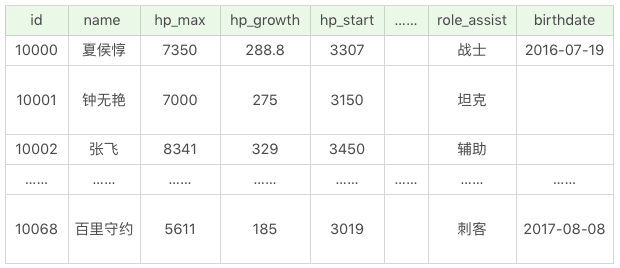
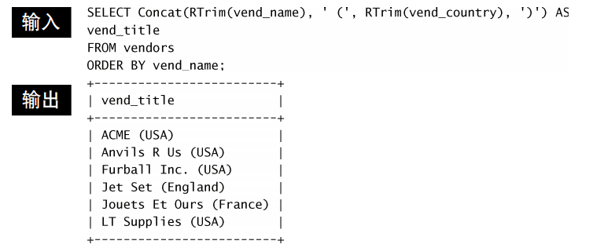
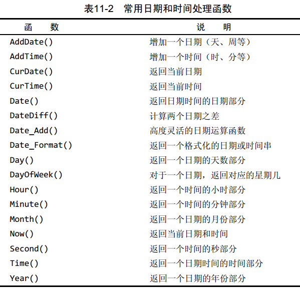
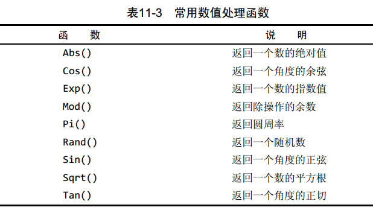
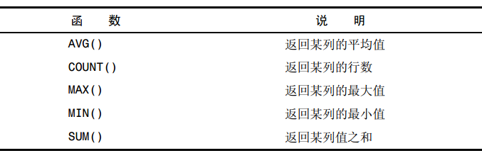
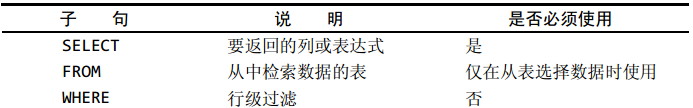
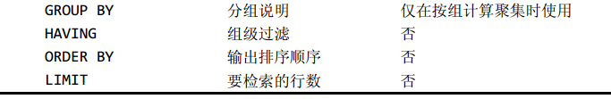

# SELECT 相关知识点

## 基础知识



下面的 SQL 语句都是基于这个表的。

### 查询列

```sql
SELECT name FROM heros;
SELECT name, hp_max, mp_max, attack_max, defense_max FROM heros;
SELECT * FROM heros;
```

### 起别名

```sql
SELECT name AS n, hp_max AS hm FROM heros;
```

### 查询常数

```sql
SELECT '王者荣耀' as platform, name FROM heros;
```


### 去除重复行

```sql
SELECT DISTINCT attack_range FROM heros;
SELECT DISTINCT attack_range, name FROM heros; 
# DISTINCT 必须放在所有列名前面
```

### 排序检索的数据

使用 `ORDER BY` 子句可以排序

- 排序的列名： `ORDER BY` 后可以有一个或者多个列名，并且第一列先排序，第一列相同的情况下，再按照第二列进行排序，一次类推。
- 排序的顺序： `ORDER BY` 可以指定顺序，`ASC` 代表递增排序（默认），`DESC` 代表递减排序。
- 非选择列排序：可以按照非选择列进行排序，所以即使在 SELECT 后面没有这个列名，同样可以放到 ORDER BY 后面进行排序
-  `ORDER BY` 位置：通常位于 SELECT 语句的最后一条子句，否则会报错

```sql
SELECT name, hp_max FROM heros ORDER BY hp_max DESC;
```

### 约束返回结果的数量

使用 `LIMIT` 关键字可以限制返回记录数

```sql
SELECT name, hp_max FROM heros ORDER BY hp_max DESC LIMIT 5;
```

### 统计记录数量

```sql
-- 查询所有记录的条数
SELECT COUNT(*) FROM access_log; -- CONUT(1) 和 CONUT(*) 可以认为等效

-- 查询websites 表中 alexa列中不为空的记录的条数
SELECT COUNT(alexa) FROM websites;

-- 查询websites表中 country列中不重复的记录条数
SELECT COUNT(DISTINCT country) FROM websites;
```


## SELECT  顺序

### 关键字顺序

```sql
SELECT ... FROM ... WHERE ... GROUP BY ... HAVING ... ORDER BY ...
```

### 语句执行顺序

```sql
SELECT DISTINCT player_id, player_name, count(*) as num # 顺序 5
FROM player JOIN team ON player.team_id = team.team_id # 顺序 1
WHERE height > 1.80 # 顺序 2
GROUP BY player.team_id # 顺序 3
HAVING num > 2 # 顺序 4
ORDER BY num DESC # 顺序 6
LIMIT 2 # 顺序 7;

FROM > WHERE > GROUP BY > HAVING > SELECT 的字段 > DISTINCT > ORDER BY > LIMIT
```

## Where 子句

eg:

```sql
SELECT name, hp_max FROM heros WHERE hp_max > 6000;
SELECT name, hp_max FROM heros WHERE hp_max BETWEEN 5399 AND 6811;
SELECT name, hp_max FROM heros WHERE hp_max IS NULL;
SELECT name, hp_max, mp_max FROM heros WHERE hp_max > 6000 AND mp_max > 1700 ORDER BY (hp_max+mp_max) DESC;
```

## 函数

### 字符串合并

- Concat



### 文本处理函数

- Left() 返回串左边的字符
- Right() 返回串右边的字符
- Lower() 将串转换为小写
- Upper() 将串转换为大写
- LTrim() 去掉串左边的空格
- RTrim() 去掉串右边的空格
- Trim() 去掉串左右量边的空格
- Length() 返回串的长度
- Locate() 找出串的一个子串
- Soundex() 返回串的 SOUNDEX 值，SOUNDEX是一个将任何文
本串转换为描述其语音表示的字母数字模式的算法
- SubString() 返回子串的字符

### 时间处理函数



### 数值处理函数



### SQL 聚集函数



### COUNT()函数

- 使用 COUNT(*) 对表中行的数目进行计数， 不管表列中包含的是空
值（NULL）还是非空值
- 使用 COUNT(column) 对特定列中具有值的行进行计数，忽略
NULL值

## 数据库分组 GROUP BY

- 使用 `WITH ROLLUP` 关键字可以额外得到汇总数据
- 过滤分组：HAVING；支持所有的 WHERE 子句
  
  > 与 WHERE 的区别 WHERE 在数据分组前进行过滤， HAVING在数据分组后进行过滤

- 一般在使用 GROUP BY 子句时，应该也给出 ORDER BY 子句，不要仅依赖 GROUP BY 排序数据

## SELECT 子句及其顺序




## 子查询

## 联结表

### 联结方式

- 内部联结/等值联结
- 自联结
  - 单条 SELECT 中不止一次的引用同一张表
  - 用子查询可以实现相同的功能，但是通常联结效率更高

```sql
-- 如下查询 2020-08-20 创建订单的商品的历史订单号
-- 子查询
SELECT order_id FROM orders WHERE product_id = (SELECT product_id FROM orders where Date(created_at) = "2020-08-20");
-- 自联结
SELECT o1.order_id FROM orders as o1, orders as o2 WHERE o1.product_id = o2.product_id AND Date(o2.created_at) = "2020-08-20";
```

- 外部联结
  - 将一个表中的行与另一个表中的行相关联，但是包含没有关联行的那些行
  - 分为左外部联结和右外部联结，唯一差别是所关联的表的顺序不同

## 组合查询 UNION

UNION的使用很简单。所需做的只是给出每条SELECT语句，在各条语
句之间放上关键字UNION

- UNION ALL 不去除重复行

## 全文本搜索

- MyISAM 支持全文本搜索
- InnoDB 不支持全本搜索
