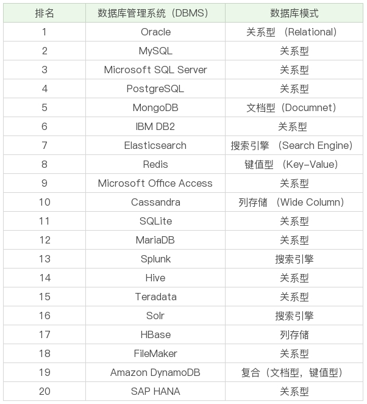

# SQL 基础

## 简介

### 是一门声明式语言

### SQL 语言的 4 个部分

- DDL，英文叫做 `Data Definition Language`，也就是数据定义语言，它用来定义我们的数据库对象，包括数据库、数据表和列。通过使用 DDL，可以创建，删除和修改数据库和表结构。
- DML，英文叫做 `Data Manipulation Language`，数据操作语言，我们用它操作和数据库相关的记录，比如增加、删除、修改数据表中的记录。
- DCL，英文叫做 `Data Control Language`，数据控制语言，我们用它来定义访问权限和安全级别。
- DQL，英文叫做 `Data Query Language`，数据查询语言，可以用它查询想要的记录，是 SQL 语言的重中之重。在实际的业务中，我们绝大多数情况下都是在和查询打交道。

### 关于大小写

- 是否大小写敏感可以通过 `MySQL` 配置去改变，建议按照下述规则执行
- 表名、表别名、字段名、字段别名等都小写
- `SQL` 保留字、函数名、绑定变量等都大写

### 常见数据库



#### 数据库分类

- 关系型数据库（RDBMS），`SQL` 属于关系型数据库的查询语言
- 非关系型数据库，NoSQL
  - 键值型数据库（如：`Redis`）
  - 文档型数据库（如：`MongoDB` ）
  - 搜索引擎（如：`Elasticsearch`）
  - 列存储，将数据按照列存储到数据库中，相同列的数据类型相同，方便压缩可以降低系统 `I/O`
  - 图形数据库，高效解决复杂关系问题，如社交网络中人与人的关系

## MySQL 中 SQL 的执行过程


- 连接层：客户端和服务器端建立连接，客户端发送 `SQL` 至服务器端
- SQL 层：对 `SQL` 语句进行查询处理
- 存储引擎层：与数据库文件打交道，负责数据的存储和读取

#### 具体执行流程 ==== TODO ====

## 存储引擎

`MySQL` 中每个表都可以采用不同的存储引擎，可以根据实际的业务来进行选择。

- `InnoDB `：MySQL 5.5 版本之后默认的存储引擎，最大的特点是支持事务、行级锁定、外键约束等
- `MyISAM `：在 MySQL 5.5 版本之前是默认的存储引擎，不支持事务，也不支持外键，最大的特点是速度快，占用资源少
- `Memory `：使用系统内存作为存储介质，以便得到更快的响应速度
- `NDB `：也叫做 NDB Cluster 存储引擎，主要用于 MySQL Cluster 分布式集群环境
- `Archive `：它有很好的压缩机制，用于文件归档，在请求写入时会进行压缩，所以也经常用来做仓库

## SQL 命令

- 定义 / 删除数据库

  ```sql
  CREATE DATABASE nba; // 创建一个名为 nba 的数据库
  DROP DATABASE nba; // 删除一个名为 nba 的数据库
  ```

- 定义数据表

  ```sql
  CREATE TABLE table_name;
  
  DROP TABLE IF EXISTS `player`;
  CREATE TABLE `player`  (
    `player_id` int(11) NOT NULL AUTO_INCREMENT,
    `team_id` int(11) NOT NULL,
    `player_name` varchar(255) CHARACTER SET utf8 COLLATE utf8_general_ci NOT NULL,
    `height` float(3, 2) NULL DEFAULT 0.00,
    PRIMARY KEY (`player_id`) USING BTREE,
    UNIQUE INDEX `player_name`(`player_name`) USING BTREE
  ) ENGINE = InnoDB CHARACTER SET = utf8 COLLATE = utf8_general_ci ROW_FORMAT = Dynamic;
  
  ```

  其中 `player_name` 字段的字符集是 `utf8`，排序规则是`utf8_general_ci`，代表对大小写不敏感，如果设置为`utf8_bin`，代表对大小写敏感。

   `player_id` 设置为了主键，因此在 DDL 中使用`PRIMARY KEY`进行规定，同时索引方法采用 BTREE。

  对 `player_name` 字段进行索引，在设置字段索引时，我们可以设置为`UNIQUE INDEX`（唯一索引），也可以设置为其他索引方式，比如`NORMAL INDEX`（普通索引），这里我们采用`UNIQUE INDEX`。唯一索引和普通索引的区别在于它对字段进行了唯一性的约束。

- 修改表结构

  ```sql
  ALTER TABLE player ADD (age int(11)); // 添加字段
  ALTER TABLE player RENAME COLUMN age to player_age; // 修改字段名
  ALTER TABLE player MODIFY (player_age float(3,1)); // 修改字段数据类型
  ```

- `profiling ` 开启可以收集 `SQL` 在执行的过程中使用资源的情况

  ```sql
  select @@profiling;  // 查看开关状态
  set profiling=1; // 开启
  show profiles; // 查看当前会话所产生的所有 Profiles
  show profile; // 获取上一次查询的执行时间
  show profile for query 2; // 指定 query 查询
  ```


## 数据表的约束

- 主键约束

  主键起的作用是唯一标识一条记录，不能重复，不能为空，即 UNIQUE+NOT NULL

- 外键约束

  外键确保了表与表之间引用的完整性，一个表中的外键对应另一张表的主键。而且外键是可以重复的，也可以为空。

- 唯一性约束

  唯一性约束表明了字段在表中的数值是唯一的，即使有主键的存在，还可以最其他字段进行唯一性的约束

- NOT NULL 约束

- DEFAULT 约束

- CHECK 约束

  用来检查特定字段取值范围的有效性

## 设计数据表的原则

- 数据表越少越好。数据表越少，证明实体和联系设计得越简洁，既方便理解又方便操作。

- 数据表中的字段个数越少越好。

  设置字段个数少的前提是各个字段相互独立，而不是某个字段的取值可以由其他字段计算出来。当然字段个数少是相对的，我们通常会在数据冗余和检索效率中进行平衡。

- 数据表中联合主键的字段个数越少越好

  设置主键是为了确定唯一性，当一个字段无法确定唯一性的时候，就需要采用联合主键的方式（也就是用多个字段来定义一个主键）。

- 使用主键和外键越多越好

  数据库的设计实际上就是定义各种表，以及各种字段之间的关系。这些关系越多，证明这些实体之间的冗余度越低，利用度越高。

  

