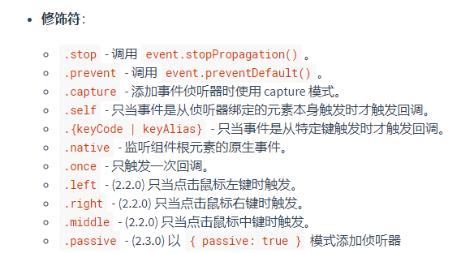

# Vue 创建

## el 挂载点

- 作用范围：管理 el 选项命中的元素及其内部的后代元素
- 支持多种选择器，建议使用 ID 选择器
- 可以使用其他的双标签，不能使用 HTML 和 body 标签

## data 数据对象

- Vue 中的数据定义在 data 中
- data 中可以写复杂类型的数据

## v-text

设置元素的文本

## v-html

设置元素的 innerHtml

```javascript
var app = new Vue({
  el: "#app",
  data: {
    content: "<a href='#'>Just for fun</a>"
  }
})
```

```html
<div id="app">
  <p v-html="content"></p> <!-- 显示 a 标签 -->
  <p v-text="content"></p> <!-- 显示字符串 -->
  <p>{{ content }}</p>     <!-- 显示字符串 -->
</div>
```

## v-on

- 为元素绑定事件
- 完整写法是 `v-on:事件名`
- 简写是 `@事件名`

```javascript
var app = new Vue({
  el: "#app",
  data: {
    message: "message: "
  },
  methods: {
    hello(xxx) {
      console.log(xxx)
      this.message += " hello";
    }
  }
})
```

```html
<div id="app">
  <h2>{{ message }}</h2>
  <input type="button" value="v-on 指令" v-on:click="hello">
  <input type="button" value="v-on 简写" @click="hello(xxx)">
</div>
```

### 事件修饰符

[https://cn.vuejs.org/v2/api/#v-on](https://cn.vuejs.org/v2/api/#v-on)



## v-show

- 作用是根据真假切换元素的显示状态
- 原理是修改元素的 display 属性
- 指令后面的内容最终都会被解析成布尔值

## v-if

- 根据表达式的真假，切换元素的显示和隐藏（操作 dom 元素）
- 本质是通过操作 dom 元素来切换显示状态
- 表达式的值为 true 时，元素存在于 dom 树中，为 false 则从 dom 树中移除。

## v-bind

- 设置元素属性
- 完整写法是 `v-bind:属性名`
- 简写是 `:属性名`

```html
<div id="app">
  
  
  
  
  
  
</div>
```

## v-for

```html
<div id="app">
  <ul>
    <li v-for="(item, index) in arr" :title="item">
      {{ index }}{{ item }}
    </li>
  </ul>
</div>
```

```javascript
var app = new Vue({
  el: "#app",
  data: {
    arr: [1, 2, 3, 4],
  }
})
```

## v-model

- 获取和设置表单元素的值（双向数据绑定）
